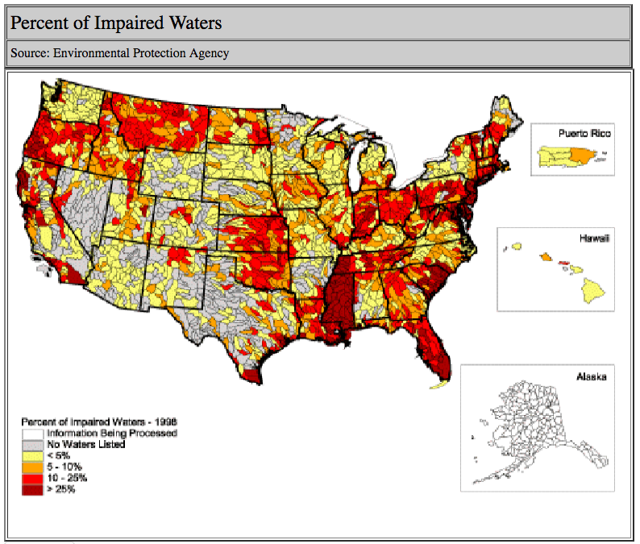

```{r test_setup, echo = FALSE, message=FALSE}
options(knitr.table.format = "html")
library(plyr)

library(dplyr)
library(ecosscraper)
library(fuzzyjoin)
library(ggplot2)
library(kableExtra)
library(knitr)
library(leaflet)
library(parallel)
library(rredlist)
library(rio)
library(rmapshaper)
library(RPostgreSQL)
library(stringr)
library(tokenizers)
library(us.geonames)

# read in some data
cnt_occ <- readRDS("data/ESA_county_occurrences.rds")
fiveyr_table <- readRDS("data/fiveyr_table_2016-12-17.rds")

# TECP_table <- get_TECP_table()
# tne <- TECP_table %>% filter_listed() %>% filter(U_S__or_ForeignListed != "Foreign")

con <- dbConnect(
  dbDriver("PostgreSQL"),
  dbname = "esc-dev",
  user = "postgres",
  password = "SillySilly1!",
  host = "localhost"
)

tne <- dbSendQuery(con, "select * from tecp_table") %>%
  dbFetch() %>%
  filter_listed() %>%
  filter_domestic()

get_text <- function(file) {
    text <- readLines(con = file) %>%
      paste(collapse = " ") %>%
      str_replace_all("[ ]{2,}", " ")
    return(text)
}

simple_tab <- function(v, vname = "var", useNA = "always", n = 10) {
  table(v, useNA = useNA) %>% 
    sort(decreasing = TRUE) %>%
    as_data_frame() %>%
    plyr::rename(replace = c("v" = vname)) %>% 
    head(n) %>%
    kable() %>%
    kable_styling(bootstrap_options = "hover")
}
```

# Extinction and the ESA {#extinct}

<div class="abstract">
_Abstract_

The success of the Endangered Species Act is often measured by comparing the
number of species declared extinct to the number of listed species, which 
indicates success on the order of 99%. Here we check that measure against the 
discussions of extinction by the Fish and Wildlife Service and the National 
Marine Fisheries Service by computationally mining five-year status reviews. We
find that 80 (~5%) ESA-listed species are known to be or are likely to be 
extinct. The extinctions are concentrated in Hawaii and a swath that extends
from Mississippi to Virginia. 
</div>

The extinction crisis of the modern era was a key motvation for the ESA: the 
goals of the law include preventing extinction and recovering species so they 
are no longer threatened with extinction. One of the ways ESA success is 
measured is by comparing the number of listed species to the number that are 
extinct. As of this writing, ten species have been removed from the list of 
threatened and endangered species, and the list includes 1,652 species. Those 
numbers suggest `r 100 - (100 * round(10 / 1652, 3))`% of species have been 
saved by the ESA, which is a great accomplishment.

But there are a few problems with using the number of species "delisted due to 
extinction" as the metric of success. First, it ignores the key goal of species
recovery and uses the lower bar of mere existence as success. But we normally
don't want to argue that plants and animals known only to exist in captivity 
count as successes. Success is wildlife out in their homes on the landscape.

Second, we know that the ten delisted species are simply the ones formally
accepted as extinct. But proving extinction is tough; we have too many examples
where a species hadn't been seen for many, many years--multiple decades and even
over a century--only to be rediscovered. For such reasons, declarations 
of extinction are a rare occurrence. At the same time, we often have a  darn 
good idea that well-documented species are really-and-truly extinct. We hold off
on the declarations of extinction and the removal of protections because of the
small but real chance that one or a few individuals still exist. 

Here we identify the species that experts - biologists with the U.S. Fish 
and Wildlife Service (FWS) and National Marine Fisheries Service (NMFS; 
collectively, the Services) - have good reason to believe are or may be extinct.
_Declaring_ extinction may not be warranted for many or most of these, but 
these professionals have indicated that extinction is likely to some greater or
lesser degree. Getting a better handle on the number of species thought to be
extinct rather than relying on the number delisted due to extinction is an 
important first step in thoroughly understanding the effectiveness of the ESA.

## Identifying possible/probably extinctions

The first question we address is how many species are extinct. Pinning
down that number is tricky because extinction is fundamentally hard because 
proving absence is so difficult. Rather than a declaration of extinct,
we set the bar at a level of experts' statements that they think the species
is or may be extinct. We mined the text of all 
[~1,400 five-year status reviews, totalling >30,000  pages](https://www.fws.gov/southeast/endangered-species-act/five-year-reviews/), 
we need to find a relatively [small number of phrases](#phrase_patterns) that indicate extinction. 

```{r terms_1, echo = FALSE}
src <- "~/Downloads/five_year_review"
fils <- list.files(src, full.names = TRUE, recursive = TRUE)

terms <- c(
  "(possibly|may be|have become) extinct",
  "(certainly being|probably|is|likely|probably being) extinct",
  "no (populations|individuals)( are)* known",
  "no( known| living)* individuals",
  "extinct in( the)* wild",
  "last (seen|observed|found) in [0-9oOiI]+",
  "functionally extinct"
)

proc_file <- function(f) {
  cat(paste("\nProcessing:", basename(f), "\n"))
  text <- get_text(f) %>%
    tokenize_sentences(lowercase = TRUE, simplify = TRUE)
  res <- data_frame(file = NA, patt = NA, doc = NA, mats = NA)
  for(i in 1:length(terms)) {
    mat <- grep(text, pattern = terms[i], fixed = FALSE, value = TRUE)
    nhit <- length(mat)
    if(nhit > 0) {
      resi <- data_frame(file = rep(f, nhit), 
                         doc = rep(basename(f), nhit),
                         patt = rep(i, nhit), 
                         mats = mat)
    } else {
      resi <- data_frame(file = f, patt = i, doc = basename(f), mats = NA)
    }
    res <- rbind(res, resi)
  }
  return(res)
}

# t1 <- parallel::mclapply(fils, 
#                          proc_file, 
#                          mc.cores = 3, 
#                          mc.preschedule = FALSE)
# ext_pat <- bind_rows(t1) %>% filter(!is.na(mats))
# fname <- paste0("data/extinct_patt_matches-", Sys.Date(), ".rds")
# saveRDS(ext_pat, fname)
fname <- paste0("data/extinct_patt_matches-2017-09-12.rds")
ext_pat <- readRDS(fname)
```

This search returned `r dim(ext_pat)[1]` matches to 
[the set of candidate phrase patterns](#phrase_patterns), including patterns
that indicate a higher likelihood of extinction such as:

<div class="narrow-tab">
```{r patt_2, echo = FALSE} 
t4 <- filter(ext_pat, patt == 2) %>% 
  select(mats) %>% 
  data.frame() %>%
  head(10)
kable(paste("-", t4$mats))
```
</div>

```{r load_manual, echo = FALSE}
# fiveyr_table <- readRDS("data/fiveyr_table_2016-12-17.rds")
# w_spp <- left_join(ext_pat, fiveyr_table, by = "doc")
# rio::export(w_spp, "data/ext_patt_w_spp.xlsx")
#
###### MANUAL FILTER #######
#
ext_5yr <- readRDS("data/extinct_manual_check_2017-09-05.rds")

extinct <- filter(ext_5yr, true_positive == "T")
```

Perusing the pattern matches, we find (as expected) both true positives (i.e.,
the meaning of the matched sentence comports with the idea we have in mind) and
false positives (e.g., local extinctions or species previously believed extinct
but since re-discovered). To ensure we are working with the right numbers, we 
manually checked each 5-year review with an extinction phrase match to remove
the false-positives.

From the manually filtered data we find `r length(unique(extinct$Species))`
species that are believed extinct to some greater or lesser degree, plus the 
snail genus _Achatinella_ (see below). 

<div class="cols-2">
```{r echo=FALSE}
spp <- sort(unique(extinct$Species[!is.na(extinct$Species)]))
half <- ceiling(length(spp) / 2)
first <- spp[1:half]
secnd <- spp[(half+1):length(spp)]
kable(first)
kable(secnd)
```
</div>

<div class="main-result">
Together with the ten species that have been [delisted due to extinction](https://ecos.fws.gov/ecp0/reports/delisting-report), **85 (`r 100*round(85/(dim(tne)[1] + 41), 2)`%) current or formerly ESA-listed species are thought, to some greater or lesser extent, to be extinct.**
</div>

Most of the extinct species are from Hawaii, with many that are plants
[Box 1](#box_1) or snails [Box 2](#box_2). Note that we collapse all 31 extinct
species in the genus _Achatinella_ to "_Achatinella_ spp." in subsequent
analyses because they were all from the same place and faced the same threats.
To count them individually when trying to understand broad patterns related to
extinction would bias our inferences.

## Geography of extinctions

The next question is where the extinctions have occurred. Hawaii, of course, 
tops the list, but where are the other species?

```{r state_level, echo = FALSE, fig.cap="States with the most (likely) extinctions."}
w_co <- left_join(extinct, cnt_occ, by = c("Species" = "SCI"))
spp_w_st <- distinct(w_co, Species, STATE)
dist <- filter(ext_5yr, true_positive == "T") %>% 
  distinct(Species, .keep_all = TRUE) %>%
  filter(!is.na(Date))

ext_geo <- left_join(dist, cnt_occ, by = c("Species" = "SCI"))
ext_geo_state <- distinct(ext_geo, Species, STATE, .keep_all = TRUE)
ext_state_cnt <- table(ext_geo_state$STATE) %>% 
  sort(decreasing = TRUE) %>%
  as_data_frame()

states <- readRDS(file = "data/state-simple.geo.json")
names(ext_state_cnt) <- c("NAME10", "n_extinct")
state_ext_geo <- sp::merge(states, ext_state_cnt)

n_ex_bins <- c(0, 1, 2, 3, 5, 24)
n_ex_pal <- colorBin(
  "YlOrRd", 
  domain = state_ext_geo$n_extinct, 
  bins = n_ex_bins
)

labels <- sprintf(
  "<strong>%s</strong><br/>%g 'extinct' species",
  state_ext_geo$NAME10, state_ext_geo$n_extinct
) %>% lapply(htmltools::HTML)

leaflet(state_ext_geo) %>%
  setView(-110, 45, 3) %>%
  # addProviderTiles("Stamen.TonerLite") %>%
  addPolygons(
    fillColor = ~n_ex_pal(n_extinct),
    weight = 1,
    opacity = 1,
    color = "white",
    fillOpacity = 0.7,
    highlight = highlightOptions(
      weight = 2,
      color = "#666",
      dashArray = "",
      fillOpacity = 0.7,
      bringToFront = TRUE),
    label = labels,
    labelOptions = labelOptions(
      style = list("font-weight" = "normal", padding = "3px 8px"),
      textsize = "15px",
      direction = "auto")
  ) %>% 
  addLegend(
    pal = n_ex_pal,
    values = ~n_extinct,
    opacity = 0.7, 
    title = NULL,
    position = "bottomright"
  )
```

Again, Hawaii clearly shows up with the most species, but the swath from 
Mississippi to Virginia stands out too. Most of these species are mussels and
fish, so the issue could be related to the problems apparent in this (albeit old) [Clean Water Act 303(d) impaired waters](https://www.epa.gov/tmdl) map:



Impairment as measured by EPA standards is not the complete answer why 
are extinctions not higher in other states with realtively high impairment.

<div class="narrow-tab">
```{r echo=FALSE}
names(ext_state_cnt) <- c("state", "n_extinct")
table(ext_geo_state$STATE) %>%
  sort(decreasing = TRUE) %>%
  as_data_frame() %>%
  rename("state" = "Var1") %>%
  head() %>%
  kable() %>%
  kable_styling(bootstrap_options = "hover")
```
</div>

----

In addition to the state-level patterns of extinction, we can use counties of
occurrence to evaluate patterns of the geography of extinction. The ten counties
with the most extinct species include:

<div class="narrow-tab">
```{r county_level, echo = FALSE, fig.cap="Ten counties with the greatest number of likely extinct, ESA-listed species. Excludes 'NA' entries for species lacking county data."}
ext_geo$co_st <- paste0(ext_geo$NAME, ", ", ext_geo$STATE)
ext_geo_st_co <- distinct(ext_geo, Species, co_st, .keep_all = TRUE)
table(ext_geo_st_co$co_st) %>%
  sort(decreasing = TRUE) %>%
  as_data_frame() %>%
  filter(Var1 != "NA, NA") %>%
  rename(`State, County` = Var1) %>%
  head(10) %>%
  kable() %>%
  kable_styling(bootstrap_options = "hover")
```
</div>

As expected, Hawaiian counties top the list, followed by Guam, then southern
Appalachian counties in Tennessee, Virginia, and Kentucky. Thus, although 
Alabama and Mississippi have more extinct, listed species than these states,
those species are (were) more concentrated in Tennessee, Virginia, and Kentucky.

## Common threats and habitats

Given the list of likely extinct species, we would like to know what they have
in common. Any commonalities might help inform prioritization efforts that can
stem future extinctions. We build off of the data available through the [IUCN's Red List database](http://apiv3.iucnredlist.org/).

### Habitats

```{r echo=FALSE}
# ext_iucn_habitat <- lapply(
#   unique(ext_geo$Species), 
#   rl_habitats, 
#   key = "b14503ec6ef80c6c07ca33baf728efdbc2f10fc6373d779f0d7efb8b98049ee7"
# )
# for(i in 1:length(ext_iucn_habitat)) {
#   ext_iucn_habitat[[i]]$result$species <- ext_iucn_habitat[[i]]$name
# }
# ext_iucn_habitat_dfs <- lapply(ext_iucn_habitat, `[[`, 2)
# ext_iucn_habitat_df <- bind_rows(ext_iucn_habitat_dfs)
# saveRDS(ext_iucn_habitat_df, file = "data/extinct_iucn_habitat.rds")
ext_iucn_habitat_df <- readRDS("data/extinct_iucn_habitat.rds")
table(ext_iucn_habitat_df$habitat, useNA = "always") %>% 
  sort(decreasing = TRUE) %>%
  as_data_frame() %>%
  rename(habitat = Var1) %>%
  head(10) %>%
  kable() %>%
  kable_styling(bootstrap_options = "hover")
```

The most common defined habitats for the extinct species parallels those species'
geography: subtropical / tropical forests of Hawaii where species such as the
_Achatinella_ snails, various plants, and birds lived. Inland wetlands, in 
particular the rivers, streams, and creeks inhabited by likely extinct mussels
and fishes, are the second major group. Last, notice the most common habitat 
type is actually "NA." This points to a limitation of the IUCN's database - 
incomplete information - that we will propose to help address in another venue.

### Threats

```{r echo=FALSE}
# ext_iucn_threats <- lapply(
#   unique(ext_geo$Species), 
#   rl_threats, 
#   key = "b14503ec6ef80c6c07ca33baf728efdbc2f10fc6373d779f0d7efb8b98049ee7"
# )
# for(i in 1:length(ext_iucn_threats)) {
#   ext_iucn_threats[[i]]$result$species <- ext_iucn_threats[[i]]$name
# }
# ext_iucn_threats_dfs <- lapply(ext_iucn_threats, `[[`, 2)
# ext_iucn_threats_df <- bind_rows(ext_iucn_threats_dfs)
# table(ext_iucn_threats_df$title) %>% sort(decreasing = TRUE)
# no_iucn_threat <- filter(ext_iucn_threats_df, is.na(title))
# no_thr_syn <- lapply(
#   unique(no_iucn_threat$species),
#   rl_synonyms, 
#   key = "b14503ec6ef80c6c07ca33baf728efdbc2f10fc6373d779f0d7efb8b98049ee7"
# )
# no_thr_syn_res <- lapply(no_thr_syn, `[[`, 3) %>% bind_rows()
# 
# ext_iucn_thr2 <- lapply(
#   unique(no_thr_syn_res$accepted_name), 
#   rl_threats, 
#   key = "b14503ec6ef80c6c07ca33baf728efdbc2f10fc6373d779f0d7efb8b98049ee7"
# )
# for(i in 1:length(ext_iucn_thr2)) {
#   ext_iucn_thr2[[i]]$result$species <- ext_iucn_thr2[[i]]$name
# }
# ext_iucn_thr2_dfs <- lapply(ext_iucn_thr2, `[[`, 2)
# ext_iucn_thr2_df <- bind_rows(ext_iucn_thr2_dfs)
# 
# extinct_spp_iucn_threats <- ext_iucn_threats_df %>%
#   select(8, 1:7) %>%
#   rbind(ext_iucn_thr2_df) %>% 
#   filter(!(species %in% no_thr_syn_res$synonym))
# saveRDS(extinct_spp_iucn_threats, file = "data/extinct_iucn_threats.rds")
extinct_spp_iucn_threats <- readRDS("data/extinct_iucn_threats.rds")

simple_tab(extinct_spp_iucn_threats$title, vname = "title")
```


```{r echo=FALSE}
simple_tab(extinct_spp_iucn_threats$code, vname = "code")
extinct_spp_iucn_threats$simple_code <- extinct_spp_iucn_threats$code %>%
  str_split(pattern = "\\.") %>%
  lapply(FUN = `[[`, 1) %>%
  unlist()
cur_dat <- extinct_spp_iucn_threats$simple_code %>%
  table() %>%
  as_data_frame() %>%
  plyr::rename(replace = c("." = "threat_code")) %>%
  arrange(-n)
  
# qplot(sort(table(extinct_spp_iucn_threats$simple_code), de
```


<div id="box_1", class="aside-box">
## Box 1. Complementary data from PEP

The [Plant Extinction Prevention (PEP) Program](http://www.pepphi.org/) works
exhaustively to monitor and conserve Hawaiian plants. They also provide more up-
to-date data on the status of many imperiled plants than FWS documents, and 
should probably be considered authoritative for PEP species.

We downloaded the 2017-03-16 list from PEP's website then used Adobe's online
extraction service to render the tables as a spreadsheet for processing. To
begin, we have a high-level overview of how PEP classifies the covered species:

<div class="narrow-tab">
```{r echo=FALSE}
PEP <- readRDS("data/HI_PEP_2017-03-16.rds")
extrp_wild <- filter(PEP, island_designation == "PEP-EXTIRPATED" |
                       island_designation == "PEP-EXTIRPATED?")
table(PEP$island_designation) %>%
  as_data_frame() %>%
  rename(PEP_class = Var1) %>%
  kable() %>%
  kable_styling(bootstrap_options = "hover")
```
</div>

Appropriately, PEP uses "?" to denote species for which extirpation and 
extinction are unknown. The refinement of extinct in the wild vs. extinct from
the planet is also useful to consider. Last, in addition to the extinctions, the 
PEP data highlight the problem of extirpations: `r length(unique(extrp_wild$species))` 
PEP species have been (or probably have been) extirpated from one or more 
of the islands. First, the number of extirpations by island:

<div class="narrow-tab">
```{r echo=FALSE}
spXis_tab <- table(extrp_wild$species, extrp_wild$distribution)
colnames(spXis_tab) <- str_replace_all(colnames(spXis_tab), "`", "")
colSums(spXis_tab) %>% 
  sort(decreasing = TRUE) %>% 
  head(10) %>% 
  as_data_frame() %>%
  rename(extirpations = value) %>%
  kable() %>%
  kable_styling(bootstrap_options = "hover")
```
</div>

And second, by most species:

<div class="narrow-tab">
```{r echo = FALSE}
rowSums(spXis_tab) %>%
  sort(decreasing = TRUE) %>% 
  head(10) %>%
  as_data_frame() %>%
  rename(extirpations = value) %>%
  kable() %>%
  kable_styling(bootstrap_options = "hover")
```
</div>

```{r echo=FALSE}
hi_cnt <- filter(cnt_occ, STATE == "Hawaii")
pep_miss <- setdiff(unique(hi_cnt$SCI), PEP$species)
```

The PEP data adds depth to our understanding of extinctions and extirpations
among Hawaiian plants, but PEP doesn't cover all ESA-listed plants.  By 
combining PEP table with county occurrence data, we find `r length(pep_miss)` 
species are not covered by PEP; more are missing than are covered by PEP. For
these species in particular it is important for FWS to track species status. 
One way that is done is with ESA-mandated five-year reviews of species status.

```{r echo=FALSE, message=FALSE, warning=FALSE}
pep_miss_5y <- filter(fiveyr_table, fiveyr_table$Species %in% pep_miss)
pep_miss_5y$age <- as.numeric(Sys.Date() - as.Date(pep_miss_5y$Date))
date_tab <- as.Date(pep_miss_5y$Date) %>%
  lubridate::year() %>%
  table() %>%
  as_data_frame() %>%
  rename(year = '.')
p <- ggplot(date_tab, aes(x = year, y = n)) +
  geom_histogram(stat = "identity") +
  labs(x = "", y = "count") +
  ggthemes::theme_hc()
plotly::ggplotly(p)
```

There are `r length(pep_miss_5y$age)` non-PEP species with 5-year 
reviews available, and of those reviews, `r sum(pep_miss_5y$age > (365*5))` are 
out-of-date (i.e., more than five years old).
</div>

<div id="box_2", class="aside-box">
## Box 2. _Achatinella_ snails

```{r echo=FALSE}
# acha <- readxl::read_excel("data-raw/Achatinella.xlsx")
# saveRDS(acha, file = "data/Achatinella.rds")
acha <- readRDS("data/Achatinella.rds")
acha$species <- paste("Achatinella", acha$species)
```

Some `r length(unique(acha$species))` species of _Achatinella_ snails 
have been described, all native to the tropical forests of Oahu. Unfortunately, 
they have suffered more likely extinctions than any other genus of ESA-listed
species. Here we summarize the  status as given in the last five-year review 
for the genus (2011) plus status information gleaned from other sources (e.g., 
IUCN and NatureServe).

Among the `r length(unique(acha$species))` _Achatinella_, current publicly 
available information indicates
`r length(acha$believed_extinct[acha$believed_extinct == "T"])` are extinct:

<div class="cols-2">
```{r echo=F}
ext_ach <- filter(acha, believed_extinct == "T")
as_data_frame(ext_ach$species) %>%
  kable() %>%
  kable_styling(bootstrap_options = "hover")
```
</div>


</div>

## Methods

### Patterns {#phrase_patterns}

We used a set of seven [regular expression](https://www.rstudio.com/wp-content/uploads/2016/09/RegExCheatsheet.pdf) patterns as a coarse filter:

<div style="font-size:smaller">
1. `"(possibly|may be|have become) extinct"`
2. `"(certainly being|probably|is|likely|probably being) extinct"`
3. `"no (populations|individuals)( are)* known"`
4. `"no( known| living)* individuals"`
5. `"extinct in( the)* wild"`
6. `"last (seen|observed|found) in [0-9oOiI]+"`
7. `"functionally extinct"`
</div>
    
In these patterns, "|" means "or" for the set of words inside parentheses. For
example, the first pattern would match "possibly extinct," "may be extinct," or
"have become extinct." The "*" means the preceding letter or word matches zero
or more times, whereas "+" means the preceding word/letter(s) must match one or
more times. We checked all seven patterns against all 1,385 five-year reviews
we collected from [ECOS](https://ecos.fws.gov) and [NMFS's recovery site](http://www.nmfs.noaa.gov/pr/recovery/plans.htm).
